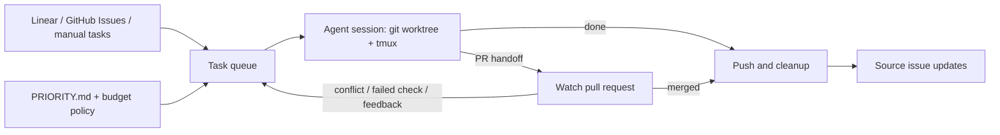

# powerqueue

[](https://github.com/aleandros/powerqueue/actions/workflows/ci.yml)
[](LICENSE)
[](Cargo.toml)

**Turn issues into coding-agent sessions, with a queue that paces model usage.**

powerqueue is a Rust CLI and daemon that takes work from Linear, GitHub Issues,
or manual tasks. It gives each task its own git worktree and tmux window,
launches an interactive agent, and monitors it through completion and PR review.
Run it on your Linux or macOS machine, or a server that stays on.

- **Prioritize work:** write rules in `PRIORITY.md` to score tasks and choose preferred models.
- **Pace usage:** reserve stronger models for critical work and release capacity as the budget period ends.
- **Keep work moving:** resume crashed sessions, watch PRs for conflicts and review feedback, and clean up completed tasks.
- **Stay involved:** inspect the dashboard, attach to any session, and answer questions when a task needs attention.

Claude Code is the default provider. Codex is optional; Antigravity (`agy`) support
is experimental. Each enabled provider has a separate budget. Pacing uses usage
readings and cost estimates; it does not guarantee that provider limits will
never be reached. See [providers and configuration](docs/configuration.md#providers).

## How it works



Sessions that need input wait for a human. A PR in review releases its session
slot so another task can start. Details: [task lifecycle](docs/task-lifecycle.md).

## Install

You need **git, tmux, and an authenticated Claude Code CLI** for the default
setup. Check the agent login with `claude auth status`. Linear and GitHub issue
intake require their own credentials; PR watching also needs an authenticated
GitHub CLI (`gh`). Windows is untested.

```sh
curl -fsSL https://raw.githubusercontent.com/aleandros/powerqueue/main/install.sh | sh
```

The installer downloads a release for Linux or macOS (x86_64 or arm64) into
`/usr/local/bin`, falling back to `~/.local/bin`. Ensure that directory is on
`PATH`. With a Rust toolchain, you can instead run:

```sh
cargo install --git https://github.com/aleandros/powerqueue
```

Use `powerqueue update` to update an installation. See the
[installation guide](docs/getting-started.md#installation) for version pinning,
source builds and restarting after an update, or download a
[release](https://github.com/aleandros/powerqueue/releases) directly.

## Quick start

Start with a manual task in an existing local repository:

```sh
cd ~/code/my-repo
powerqueue init --no-linear
powerqueue add "Fix flaky test" -c high
powerqueue doctor
powerqueue run
```

`init` writes the configuration and priority rules; `run` starts the daemon in
the foreground. The default Claude permission mode, `acceptEdits`, may wait for
you to approve shell commands. Configure [permissions](docs/configuration.md#claude)
before choosing to run unattended.

In another terminal:

```sh
powerqueue dashboard                # live task and budget view
powerqueue status                   # list tasks and their keys
powerqueue attach <task-key>        # interact with a session
powerqueue pause                    # pause new launches; running work continues
powerqueue stop                     # stop the daemon; tmux sessions stay alive
```

To start with **Linear**, use `powerqueue init --team ENG` instead of
`init --no-linear`; setup prompts for the API key. For **GitHub Issues**, follow
[GitHub setup](docs/getting-started.md#github-issues) to configure the repository,
token and intake labels. Both sources can be enabled together.

When ready to keep it running, use `powerqueue service install` (systemd on Linux,
launchd on macOS). See [Operations](docs/operations.md) for server setup and logs.

## Documentation

| I want to… | Read |
|------------|------|
| Set up Linear, GitHub Issues or a server | [Getting started](docs/getting-started.md) |
| Find a command or flag | [Command reference](docs/commands.md) |
| Configure providers, prompts or repository settings | [Configuration reference](docs/configuration.md) |
| Change task order or model preferences | [Priority rules](docs/priority.md) |
| Understand usage estimates and limits | [Budget pacing](docs/budget.md) |
| Handle PR review, questions and cleanup | [Task lifecycle](docs/task-lifecycle.md) |
| Run agents in per-task containers | [Container setup](docs/containers.md) |
| Manage the service, secrets and logs | [Operations](docs/operations.md) |
| Diagnose a problem | [Troubleshooting](docs/troubleshooting.md) |

Browse the [documentation index](docs/README.md) for examples and architecture.
`powerqueue --help` lists commands; `powerqueue <command> --help` lists flags.

## Contributing

See [CONTRIBUTING.md](CONTRIBUTING.md) and [AGENTS.md](AGENTS.md) for development
and testing. Report security issues as described in [SECURITY.md](SECURITY.md).

## License

[MIT](LICENSE).
