# Architecture

This expands [AGENTS.md](../AGENTS.md). The code is the source of truth; this
document explains how the pieces fit and why they look the way they do.

## Module map

```text
src/
  main.rs            parse CLI, dispatch, exit code
  lib.rs             module tree; VERSION, APP_NAME
  domain.rs          plain data: Task, Session, TokenUsage, ModelTier, Criticality,
                     TaskState (+ transitions), SessionState, Event, DaemonCommand, HookEvent
  config.rs          config.toml + .powerqueue.toml; defaults; validate()
  paths.rs           XDG dirs; POWERQUEUE_HOME; per-task dirs; lock/pid
  secrets.rs         env → keychain → 0600 file
  logging.rs         tracing: stderr + rotating JSON file
  store/             SQLite (rusqlite, WAL); schema.sql; all queries
  linear/            GraphQL client; issue → task sync
  github/            REST issue client; GitHub intake and synchronization
  priority/          PRIORITY.md parser/evaluator; file watcher
  jev.rs             Jev "score" client (optional)
github.rs          `gh api graphql` PR status (state, mergeability, checks, threads)
  budget/            period clock, ledger, estimator, policy (pure, plain data in and out);
                     io.rs reads the usage rows and observations from the store
  worktree.rs        git worktree ops (shell out to git)
  tmux.rs            tmux ops (shell out to tmux)
  session/           agent.rs (AgentCli trait, agent_for, shared helpers) with one
                     implementation per CLI: claude.rs, codex.rs, gemini.rs (experimental);
                     binary.rs (`<provider>.binary` command templates with per-task
                     placeholders), inbox.rs (the container shim + inbox transport for
                     `<provider>.shim`), launcher (prompt, launch.sh), hook interpretation,
                     transcript tailing, liveness + resource probes
  scheduler/         daemon.rs (Daemon, tick loop, applies Effects against the store,
                     tmux, git, Linear and GitHub) around a pure core: transitions.rs
                     (hook outcomes, probes, crashes, re-scoring, finalize → Effect
                     list), commands.rs (pause/resume/cancel/retry/model), launch.rs
                     (LaunchPlanner, on_starting/on_launched, resume plan and prompt),
                     review.rs (PR watcher), lifecycle.rs (pick_next, cleanup_plan;
                     cleanup_task is the git/tmux half)
  hook.rs            `powerqueue hook` entry (Claude Code hooks, Codex notify, agy hooks;
                     payloads normalised to the Claude shape via AgentCli::normalize_hook)
  dashboard/         ratatui TUI: Snapshot (data) / ui (render)
  doctor.rs          checks + fix hints
  cli/               clap definitions (mod.rs), Context, output helpers, one file per command
```

Dependency direction: `cli` and `scheduler::daemon` orchestrate; `budget`, `priority`,
`linear`, `github`, `session` depend on `domain`, `config`, `store`; `domain` depends on
nothing in the crate. `tmux.rs` and `worktree.rs` know nothing about tasks.

## Functional core, imperative shell

Every change to a task or session state is made by a pure function and
described by the `Effect`s it returns; the daemon is the shell that loads
rows, calls the function, persists what changed and carries out the effects.

| decides (pure, unit-tested without a database) | carries out (daemon) |
|---|---|
| `transitions::on_hook_outcome`, `on_probe`, `on_crash`, `on_progress`, `on_evaluation`, `on_dependencies`, `on_container_closed`, `on_answer_sent`, `on_answer_queued`, `release_session` | `Daemon::process_hook`, `probe_sessions`, `refresh_rules`, `close_finished_parents`, `relay_comments`, `finalize_terminal` |
| `commands::on_pause`, `on_resume`, `on_cancel`, `on_retry`, `on_set_model` | `Daemon::apply_command` |
| `launch::LaunchPlanner` (`next` / `started`), `on_throttled`, `on_starting`, `claim`, `resume_plan`, `resume_prompt`, `on_launched` | `Daemon::launch_tasks` / `start_task` (git, launcher, tmux) |
| `review::on_pr_status`, `request_round`, `on_unusable_pr`, `on_watch_error` | `Daemon::watch_reviews` (`gh`) |
| `lifecycle::pick_next`, `cleanup_plan` | `lifecycle::cleanup_task` (git, tmux) |
| `budget::Ledger::build`, `resolve_clock`, `Policy::decide`, `Estimator`, `probe::append_observation` | `budget::io` (`Ledger::load`, observations in kv) |

`Daemon::commit` persists a task only when the transition changed it
(`Task: PartialEq`) and again after the effects ran, since cleanup may
change it further. `Effect` is `Serialize`, so a run can be replayed or
checked against a model from the event log. The budget core takes
`LedgerSource` (plain usage rows and the observation history) and never
sees the store, which is what lets `budget plan` and `priority simulate`
share `LaunchPlanner` with the daemon (`budget plan` runs `plan_all`). The
planner owns the estimator and a copy of the ledgers (reservations within a
pass) and borrows the budget config, rules and rate limits per step through
`LaunchContext`, so a rate limit marked by a failed start is seen by the next
candidate of the same pass. `task pause|resume|cancel|retry` applied offline by
the CLI (no daemon) call the same `commands::*` transitions.

### Testing the core

Because the core takes plain data and returns `Effect`s, it is tested in
three layers. Example tests next to each function pin the documented
behaviour. Properties (`proptest`, `mod properties` in each pure module)
state what must hold for *every* input the generators in `src/strategies.rs`
can produce: a transition only makes moves `TaskState::can_transition_to`
lists, terminal tasks are inert, commands are idempotent, `not_before` is
cleared by anything that is not a backoff or a throttle, `KillWindow` only
follows a live session, review rounds never exceed `review_rounds_max`, the
planner hands out each task once per pass and reserves exactly the predicted
cost, the policy never picks a model it cannot use, periods tile. The
stateful model (`scheduler/model.rs`) runs random sequences of the daemon's
calls, with each call's precondition mirroring its call site, against one
task and checks the cross-cutting invariants after every step, including
that every effect round-trips through serde (the trace a specification
would consume). A failing property is a finding first: the shrunk case says
either that the invariant was overstated or that the code is wrong.

## Data flow

```text
                 ┌──────────────┐  fetch_issues   ┌───────────────┐
   Linear API ◀──┤ linear::sync ├────────────────▶│  tasks table  │◀── powerqueue add
                 └──────────────┘                 └──────┬────────┘
                                                         │ evaluate (PRIORITY.md, Jev)
                                                         ▼
                                                  score, criticality, model pref
                                                         │ pick_next
                                                         ▼
   Policy::decide ◀── Ledger (usage table) ◀── Estimator (task_usage_summaries)
         │ model or retry_at
         ▼
   worktree::Repo::add_worktree ─▶ session::Launcher::prepare/launch ─▶ tmux new-window
                                                         │
             ┌───────────────────────────────────────────┤
             ▼                                           ▼
   Claude Code hooks ─▶ powerqueue hook ─▶ hook_events   transcript .jsonl ─▶ usage table
             │                                           │
             └──────────────── daemon tick drains both ──┘
                                     │
                                     ▼
          state transitions ─▶ events table ─▶ task show / dashboard / logs --events
                                     │
                                     ▼ completed
                      cleanup_task: push, remove worktree, kill window, source issue update
```

## Storage

One SQLite file, `<data>/powerqueue.db`, in WAL mode. The daemon holds one
connection behind a mutex; the CLI and dashboard open their own read
connections. Timestamps are RFC 3339 UTC strings so they sort as text.

| Table | Written by | Read by |
|-------|------------|---------|
| `tasks` | `linear::sync` (create/update/cancel; `blocked_by`, `children`, `parent` from the issue's relations), `add`, scheduler (state, attempts, model, worktree, branch, not_before, summary), `priority` re-score (score, criticality, reasons), `task *` commands via `commands` | everything |
| `sessions` | `Launcher::launch` (insert), scheduler probes and hook drain (state, pid, pane, transcript_path, exit_code, last_activity_at) | scheduler, `task show`, dashboard, `attach`, `task output` |
| `usage` | scheduler from `TranscriptReader::read_new` (one row per `message_id`; duplicates ignored) | `Ledger::load` (per tier, period/window), `Estimator` via `task_usage_summaries`, `task show`, dashboard |
| `resource_samples` | scheduler every `resource_sample_secs` (CPU%, RSS, process count per session) | dashboard, `task show`; pruned hourly to 7 days |
| `events` | `store.log_event` on every state change, hook, crash, cleanup, error | `task show`, `logs --events`, dashboard, `doctor` (crash/idle/throttle rates by `kind`) |
| `commands` | `task pause/resume/cancel/retry/model`, `stop`, dashboard keys (`DaemonCommand` as JSON: `Pause`, `Resume`, `Cancel`, `Retry`, `SetModel`, `SyncNow`, `Reload`, `Shutdown`) | daemon `drain_commands` at the start of each tick (marks `consumed_at`) |
| `hook_events` | `powerqueue hook` (raw stdin JSON + event name) | daemon `drain_hook_events` (marks `consumed_at`) |
| `kv` | daemon heartbeat (`daemon.heartbeat` = pid + time, every tick), budget calibration per provider (`budget.calibration.<provider>`, `CALIBRATION_KEY` for Claude), observed usage per provider (`budget.observed.<provider>`), rate-limit cooldowns (`budget.rate_limits`, `RATE_LIMITS_KEY`), parent issues being watched / already closed (`linear.watched_parents`, `WATCHED_PARENTS_KEY`) | `status`/`doctor`/dashboard header (heartbeat older than 30 s = daemon down), `budget show`, ledger, policy |
| `jev_scores` | priority re-score when Jev is enabled (keyed by task, with content hash) | priority re-score (cache hit unless the hash changed) |

The estimator keeps no state of its own; it is rebuilt from
`task_usage_summaries` (tasks + usage) on every launch pass. The schema is
applied idempotently and versioned with `PRAGMA user_version` (currently 4; see `SCHEMA_VERSION`).
Foreign keys are on; deleting a task cascades to its sessions.

## State machines

### TaskState

From `TaskState::can_transition_to` in `domain.rs`. A state may always
transition to itself.

| from \ to | queued | starting | running | idle | crashed | throttled | paused | blocked | needs_attention | completed | failed | cancelled |
|-----------|:------:|:--------:|:-------:|:----:|:-------:|:---------:|:------:|:-------:|:---------------:|:---------:|:------:|:---------:|
| queued | | ✓ | | | | ✓ | ✓ | ✓ | | | | ✓ |
| starting | ✓ | | ✓ | | ✓ | | | | | | ✓ | ✓ |
| running | | | | ✓ | ✓ | ✓ | ✓ | | ✓ | ✓ | ✓ | ✓ |
| idle | | | ✓ | | ✓ | | ✓ | | ✓ | ✓ | ✓ | ✓ |
| crashed | ✓ | ✓ | | | | ✓ | ✓ | | | | ✓ | ✓ |
| throttled | ✓ | ✓ | ✓ | | | | ✓ | ✓ | | | | ✓ |
| paused | ✓ | | | | | | | | | | | ✓ |
| blocked | ✓ | | | | | | ✓ | | | ✓ | | ✓ |
| needs_attention | | | ✓ | ✓ | ✓ | | ✓ | | | ✓ | ✓ | ✓ |
| completed | ✓ | | | | | | | | | | | |
| failed | ✓ | | | | | | | | | | | |
| cancelled | ✓ | | | | | | | | | | | |

```mermaid
stateDiagram-v2
    [*] --> queued
    queued --> starting: slot + model
    queued --> throttled: no eligible tier
    queued --> paused: task pause / PRIORITY.md skip
    queued --> blocked: pending `blocked by` issue / parent of sub-issues
    blocked --> queued: blockers Done/Canceled or PR merged
    blocked --> completed: parent closed, every sub-issue done
    starting --> running: launched (SessionStart hook confirms)
    starting --> crashed: worktree, setup or launch failed
    running --> idle: Stop without marker
    running --> needs_attention: BLOCKED / question / permission prompt / auth failure
    running --> completed: DONE / task complete
    running --> in_review: task complete --pr (session, slot, worktree released)
    in_review --> completed: PR merged (branch deleted; Linear untouched)
    in_review --> queued: conflict / required check failed / new review threads (review round)
    in_review --> needs_attention: PR closed, stale, review_rounds_max used up
    needs_attention --> in_review: task resume (parked by the watcher)
    running --> crashed: pane died / stale / max_session_secs
    running --> throttled: StopFailure rate_limit
    idle --> running: UserPromptSubmit (nudge, task send, attach)
    idle --> needs_attention: idle_timeout after a nudge
    crashed --> starting: backoff elapsed (resume)
    crashed --> failed: max_attempts
    throttled --> starting: retry_at reached
    throttled --> running: cooldown passed, session still alive
    paused --> queued: task resume / skip line removed
    needs_attention --> running: task resume (session alive)
    completed --> queued: task retry
    completed --> in_review: completed without --pr, branch has an open PR
    in_review --> queued: task retry (review round)
    failed --> queued: task retry
    cancelled --> queued: task retry
    queued --> cancelled
    running --> cancelled
```



Helper predicates: `is_terminal` (completed, failed, cancelled),
`is_handed_off` (terminal or in_review: a live session is released and late
hooks never revive the task),
`has_live_session` (starting, running, idle, needs_attention),
`is_schedulable` (queued, crashed, throttled). `Task::is_waiting` (a pending
`blocked by` issue, or sub-issues) additionally keeps `pick_next` from
starting a task, whatever its state; `transitions::on_dependencies` moves
queued/throttled tasks to `blocked` and back on every re-score. The table is enforced by the
CLI's direct writes (`task complete/block` and offline `pause/resume/cancel/
retry`); the daemon's transitions are written as computed.

### SessionState

One session is one attempt. `launching → running → idle ↔ running → exited |
crashed | killed`. `is_live` is true for launching, running and idle. The
`sessions` primary key is powerqueue's session id (Claude Code's
`--session-id`). CLIs that generate their own id (Codex thread, Antigravity
conversation) get it recorded in `agent_session_id` once the daemon discovers
it (`AgentCli::discover_session`: the Codex rollout whose `session_meta.cwd`
is the worktree, agy's `last_conversations.json`), together with the
transcript path. A relaunch after a crash on the same provider reuses the row
and resumes the provider's session (`claude --resume <id>`, `codex resume
<thread>`, `agy --conversation <id>`), so the daemon overwrites the same row
with `attempt + 1`; a fresh attempt (after cancel + retry, a non-crash end, a
different provider, or a Codex/agy session whose id was never found) gets a
new id and a new row.

### Session layer

`session::agent::AgentCli` is everything provider-specific; the launcher,
`launch.sh`, tmux, probes and cleanup are shared.

| | Claude Code | Codex CLI | Antigravity CLI (experimental) |
|-|-|-|-|
| session id | ours (`--session-id`) | generated; discovered from the rollout | generated; from `last_conversations.json` |
| completion | `Stop` hook in `settings.json` | `-c notify=[...]` after every turn | `Stop` hook in `<worktree>/.agents/hooks.json` + transcript polling |
| usage | transcript `message.usage` | rollout `token_count.info.last_token_usage`, model from `turn_context` | none (no token counts) |
| rate limit | `StopFailure{rate_limit}` hook | rollout `event_msg/error` or notify text matching the signatures → synthesised `StopFailure` | hook `error` / transcript error steps |
| trust | `~/.claude.json` seeded | `-c projects={...}` per session | n/a |

`TranscriptReader` is provider-neutral: each line goes through
`observe_transcript_line` (side state: current model, rate-limit snapshot and
errors, last assistant message) and `parse_transcript_line` (usage records).
The daemon turns the side state into hook rows (`StopFailure`, or a `Stop` for
polled DONE / BLOCKED markers) that the hook phase handles on the next tick.

## Issue sources

Linear and GitHub Issues are independently configured and polled before rules
are evaluated. GitHub's REST client lives under `github/client.rs`; the existing
`github.rs` retains the `gh` CLI client for PR watching. Issue intake requires
an API token but not `gh`. Each daemon works in one configured checkout.

GitHub tasks use `TaskSource::GitHub` and keys `owner/repo#number`. The source
metadata is stored in the existing JSON column. Sync computes a preview before
applying it, skips pull requests and terminal local tasks, and cancels inactive
tasks only after a confirmed issue closure. API errors abort the preview; 404
is not interpreted as closure. Polling uses independent backoff and rate-limit
reset headers. Lifecycle effects route to the task's tracker; GitHub completion
labels/closing run on ordinary completion or after a watched PR merges. GitHub
questions can be posted, but only Linear has incoming-comment reply relay.

## The daemon tick

`Daemon::run` acquires `<state>/daemon.lock` (fd-lock), writes `daemon.pid`,
then loops `tick().await` followed by a sleep of `scheduler.tick_secs`, writing
a heartbeat to `kv` each tick. `run --once` performs one tick. SIGINT/SIGTERM
or a `Shutdown` command ends the loop; sessions keep running in tmux.

Each tick, in order (`Daemon::tick` in `scheduler/daemon.rs`; every phase is
isolated, a failure is logged as a `daemon.error` event and the next phase
still runs):

1. write the heartbeat; drain `commands` (pause, resume, cancel, retry, set
   model, sync now, reload, shutdown);
2. poll enabled Linear and GitHub issue sources on their own intervals and
   backoff schedules; synchronization creates, updates and cancels tasks
   (running tasks are never cancelled by sync);
3. reload `PRIORITY.md` if the watcher flagged a change (parse errors keep the
   previous rules); re-score open tasks that have no live session, including
   newly imported tasks, applying `skip` overrides as `paused`;
4. drain `hook_events`; `interpret_hook` maps each payload to an outcome and
   `transitions::on_hook_outcome` to state changes plus effects (cleanup,
   source issue update, rate-limit cooldown);
5. discover the provider session id and transcript of Codex / agy sessions
   (`session.discovered`), then read new transcript lines for live sessions
   (and those ended within the last 5 minutes) into `usage`; throttling
   errors and polled completion markers become hook rows;
6. probe tmux panes (`transitions::on_probe`): a dead pane without completion
   ⇒ `crashed` with `not_before` from `backoff_for_attempt` (next launch uses
   `--resume`); no activity for `stale_session_secs` or an attempt older than
   `max_session_secs` ⇒ window killed, treated as a crash; an idle task past
   `idle_timeout_secs` is nudged once with `tmux send-keys`, then
   `needs_attention`; a throttled task whose cooldown passed while its
   session stayed alive goes back to `running`;
7. release sessions of tasks that became terminal outside the hook path
   (`task complete` on the CLI, cancelled by sync): `cleanup_task`, then the
   source issue update and comment; a task handed off `in_review` gets its window
   killed and `cleanup_task(.., for_review)` (branch kept, Linear untouched);
7b. every `pr_poll_secs`, for each `in_review` task without a live session:
   `Gh::pr_status`, then `review::on_pr_status` (merged ⇒ completed + local
   branch deleted; closed ⇒ needs_attention; conflict / failed required
   check / new unresolved threads ⇒ `queued` with a pending
   `ReviewRelaunch`; hold label ⇒ wait; unchanged for `review_stale_hours`
   ⇒ Linear comment + needs_attention). A pending relaunch makes step 9
   recreate the worktree at the remembered path, resume the previous session
   even though it exited (`resume_plan(.., review)`), pass
   `scheduler.review_prompt` instead of the task prompt, and comment on
   Linear instead of moving the issue;
8. sample CPU/RSS every `resource_sample_secs`; prune samples older than 7
   days once an hour;
9. while live sessions `< max_concurrent`: `launch::LaunchPlanner::next`
   (`pick_next`, `Estimator::predict`, `Policy::decide`: throttle or start),
   `git fetch`, create the worktree, run `repo.setup`, `Launcher::prepare` +
   `launch`, then `LaunchPlanner::started` reserves the predicted cost for
   the rest of the pass; `on_launched` moves the Linear issue to
   `in_progress_state` or applies the configured GitHub in-progress label.

Every transition goes through `store.log_event` so `task show` replays the
story.

## IPC through SQLite

There is no socket, no HTTP, no signals beyond stop. Two tables are the bus:

- **`commands`**: CLI and dashboard insert a JSON `DaemonCommand`; the daemon
  consumes them in id order at the start of a tick and marks `consumed_at`.
  Commands are durable: a `task cancel` issued while the daemon is down is
  applied when it starts.
- **`hook_events`**: `powerqueue hook` (spawned by Claude Code, possibly
  several times a second) appends the raw payload and exits 0 immediately.
  The daemon drains them in order. For a `Stop` with the done/blocked marker
  the hook also flips the task state right away so the dashboard does not
  wait for the next tick.

The cost is latency of up to one tick (5 s). The benefit is that every writer
is a short-lived process with no connection to manage, and every reader can
replay history.

## Why these decisions

**Shell out to git and tmux.** No libgit2 or tmux control-mode client. The
binary stays small, behaves exactly like the user's git (hooks, config,
credential helpers, SSH agent), and errors carry the tool's own stderr. tmux
is the user's terminal multiplexer anyway; using its CLI means `attach` is
`tmux select-window`.

**SQLite in WAL mode instead of a socket server.** One file holds state,
history, the command bus and the hook inbox. The CLI works whether or not the
daemon runs, the dashboard reads concurrently, `doctor` can inspect
everything, and crash recovery is a matter of reading tables on start. A
socket server would need its own protocol, versioning and a running process
to answer `status`.

**Interactive Claude sessions instead of `claude -p`.** Print mode is
simpler to drive but nobody can step in. Interactive sessions in tmux let a
human `attach`, answer a permission prompt or a question, type a
correction, and leave again, while the daemon keeps tracking the session
through hooks. The price is that permission prompts block, which is why the
default permission mode is `acceptEdits` and why the `Notification` hook is
wired.

**Hooks instead of output parsing.** Claude Code's hook events deliver
structured JSON (`last_assistant_message`, `error_type`, `transcript_path`,
`notification_type`) at the moments that matter. Scraping the pane would be
fragile across UI changes and could not distinguish a rate limit from a
crash. The transcript JSONL is read only for token usage, where it is the
authoritative source, and pane capture is kept for humans (`task output`).

**Markdown for rules.** `PRIORITY.md` can be edited in any editor, reviewed
in a pull request, and read by the agent itself. Live reload makes the edit
loop immediate.

**Weighted tokens, not dollars.** Subscriptions are capped in usage, not
spend, and the cap is unpublished. Pacing on a weighted token model whose
exchange rate is learned from the provider's own readings (status line,
probes, `budget set-observed`), plus rate-limit signals, is the most honest
approximation available.

**XDG paths and `POWERQUEUE_HOME`.** Short, predictable paths that show well
in diagnostics; a single variable isolates test and parallel instances.
